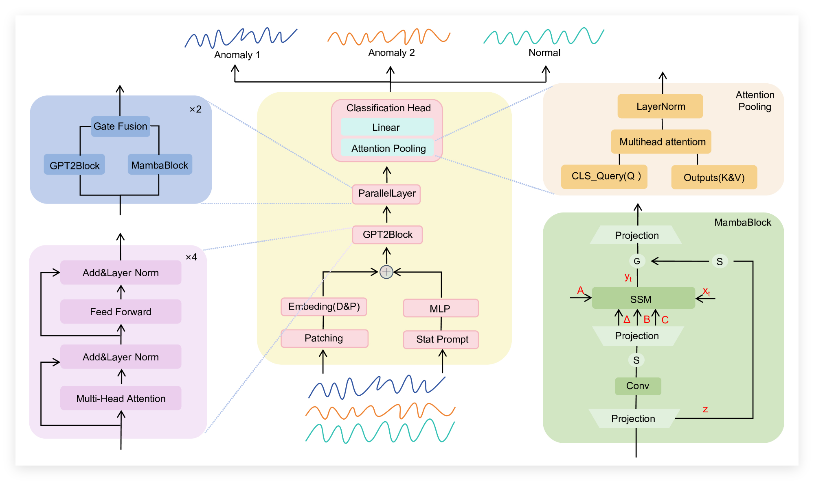
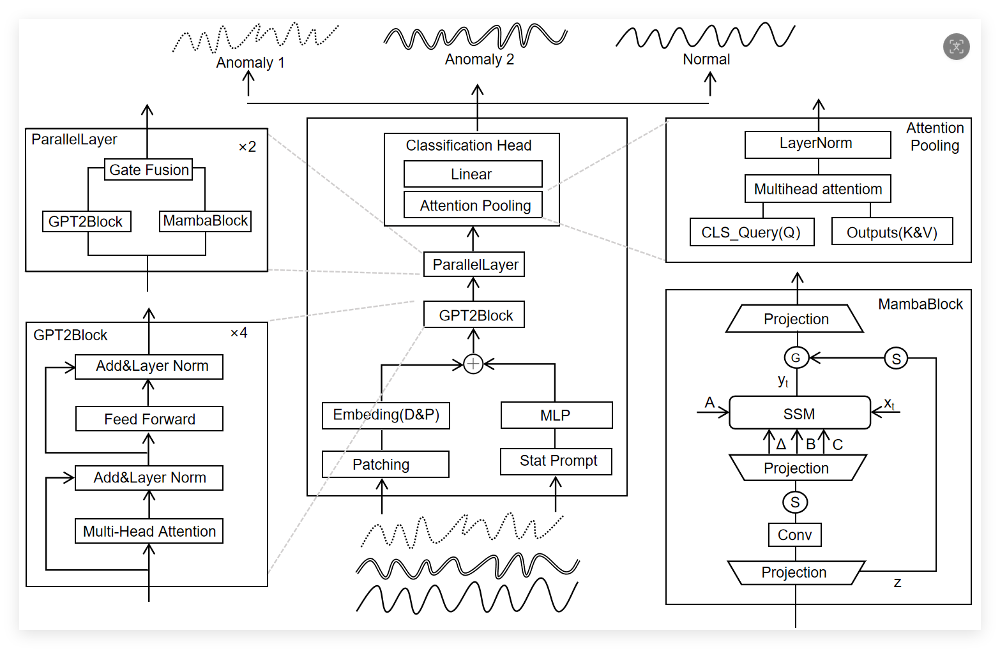
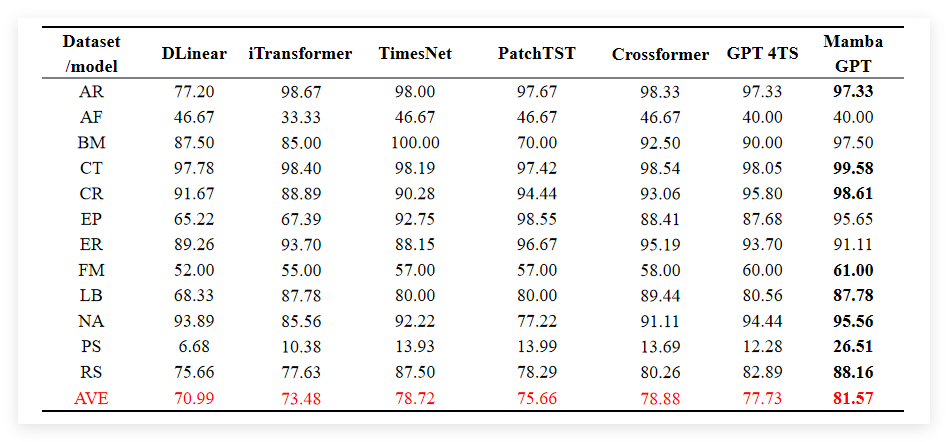
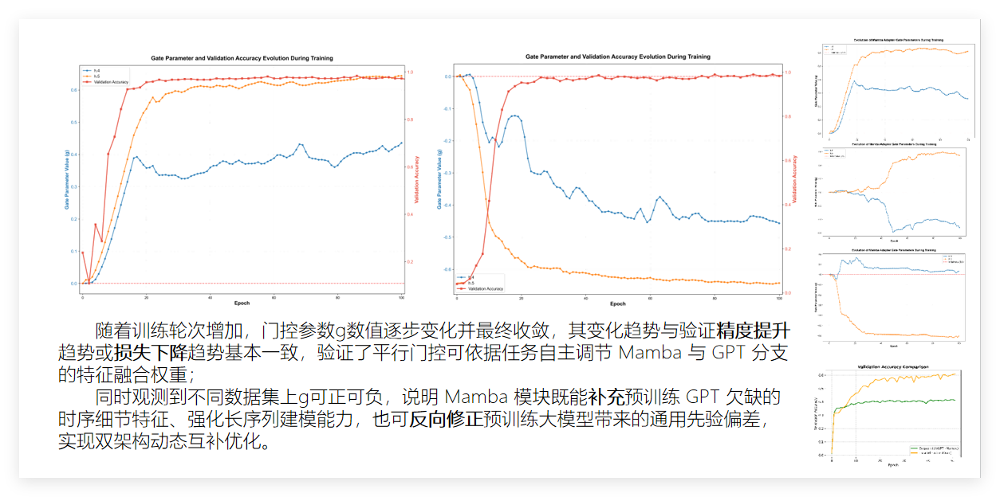
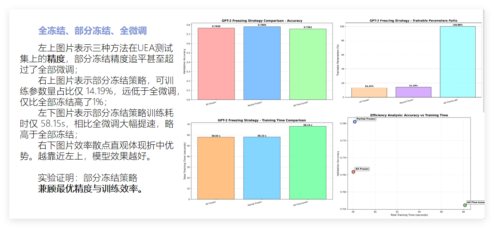

# Mamba-GPT 项目说明

本文档介绍如何快速复现 Mamba-GPT 项目中的时间序列分类实验。

---

## 模型架构图：





## 泛化能力实验结果：



## 门控追踪实验：



## 冻结策略对比



## 一、快速开始

### 1.1 环境配置

```bash
conda create -n gpt4ts-mamba2 python=3.9
conda activate gpt4ts-mamba2

pip install torch torchvision torchaudio --index-url https://download.pytorch.org/whl/cu118
pip install transformers==4.30.0 einops tqdm tensorboard openpyxl scikit-learn matplotlib

pip install mamba-ssm  # 可选，CUDA加速
```

> **自动检测**: 未安装 `mamba-ssm` 时，代码会自动使用纯 PyTorch 实现。

### 1.2 准备数据集

下载 UCR/UEA 数据集，放入 `Classification2/datasets/` 和 `Classification3/datasets/` 目录。

### 1.3 运行训练

```bash
# Classification2
cd Classification2
bash scripts/EthanolConcentration.sh

# Classification3
cd Classification3
bash scripts/EthanolConcentration.sh
```

---

## 二、Classification2 模块

### 2.1 项目结构

```
Classification2/
├── datasets/          # 数据集目录
├── scripts/           # 训练脚本（30+ 数据集）
├── src/               # 核心源代码
└── exp/
    ├── exp2/          # 门控追踪实验
    ├── exp3/          # 预训练知识迁移验证 + 小样本学习
    └── exp4/          # 模型可解释性可视化
```

### 2.2 基础训练

#### 运行单个数据集

```bash
cd Classification2
bash scripts/EthanolConcentration.sh
bash scripts/Heartbeat.sh
bash scripts/BasicMotions.sh
```

#### 运行所有数据集

```bash
cd Classification2
bash scripts/all.sh
```

#### 自定义参数

```bash
cd Classification2
python src/main.py \
    --output_dir experiments \
    --name MyExperiment \
    --data_dir ./datasets/EthanolConcentration \
    --data_class tsra \
    --pattern TRAIN \
    --val_pattern TEST \
    --epochs 100 \
    --lr 0.0001 \
    --patch_size 16 \
    --stride 8 \
    --optimizer AdamW \
    --d_model 768 \
    --gpt_layers 6 \
    --num_mamba_layers 2 \
    --pos_encoding learnable \
    --task classification \
    --key_metric accuracy \
    --gpu 0 \
    --seed 42
```

### 2.3 特殊实验

#### 实验2：门控追踪

```bash
cd Classification2/exp/exp2
bash run_exp2_gate_tracking.sh
python visualize_gates.py
```

#### 实验3：预训练知识迁移验证

**3.1 预训练 vs 随机初始化对比**

```bash
cd Classification2/exp/exp3
bash run_exp3_pretrained.sh

# 单个数据集对比
python ../../src/main.py --data_dir ../../datasets/Heartbeat --gpu 0 --epochs 100 --no_pretrained
```

**3.2 小样本学习能力验证**

使用不同比例的训练数据（20%, 40%, 60%, 80%, 100%）验证预训练模型在小样本情况下的优势：

```bash
cd Classification2/exp/exp3
bash run_exp3_fewshot.sh

# 生成可视化
python visualize_fewshot.py --data_dir results
```

#### 实验4：可解释性可视化

```bash
cd Classification2/exp/exp4
bash run_exp4.sh ../../results/BasicMotions_pretrained
```

### 2.4 Patch 消融实验

项目提供了不同 patch size 的消融实验脚本：

```bash
cd Classification2
bash scripts/patch4.sh   # patch_size=4, stride=2
bash scripts/patch8.sh   # patch_size=8, stride=4
bash scripts/patch16.sh  # patch_size=16, stride=8
bash scripts/patch32.sh  # patch_size=32, stride=16
```

### 2.5 关键参数

| 参数 | 默认值 | 说明 |
|------|--------|------|
| `--d_model` | 768 | GPT2-small 固定要求 |
| `--gpt_layers` | 6 | GPT2 层数 |
| `--num_mamba_layers` | 2 | Mamba Adapter 层数 |
| `--patch_size` | 64 | Patch 大小 |
| `--stride` | 64 | Patch 步长 |
| `--no_stat_prompt` | - | 禁用统计特征 Prompt |
| `--no_attn_pooling` | - | 禁用 Attention Pooling |
| `--no_pretrained` | - | 禁用预训练权重，使用随机初始化 |

---

## 三、Classification3 模块

### 3.1 项目结构

```
Classification3/
├── datasets/          # 数据集目录
├── scripts/           # 训练脚本（与Classification2相同）
├── src/               # 核心源代码（与Classification2类似）
└── exp/
    ├── exp5/          # 架构消融实验（四种架构模式）
    └── exp6/          # 冻结策略效率分析
```

### 3.2 基础训练

与 Classification2 相同：

```bash
cd Classification3
bash scripts/EthanolConcentration.sh
bash scripts/all.sh
```

> **注意**: Classification3 的脚本与 Classification2 基本相同，只是 GPU 卡号配置不同。

### 3.3 特殊实验

#### 实验5：架构消融实验

对比四种架构模式：Pure GPT-2、Pure Mamba、Sequential、Parallel

```bash
cd Classification3/exp/exp5
bash run_exp5.sh Heartbeat

# 单个架构模式
python main_exp5.py --dataset Heartbeat --gpu 0 --epochs 100 --arch_mode pure_gpt
python main_exp5.py --dataset Heartbeat --gpu 0 --epochs 100 --arch_mode pure_mamba
python main_exp5.py --dataset Heartbeat --gpu 0 --epochs 100 --arch_mode sequential
python main_exp5.py --dataset Heartbeat --gpu 0 --epochs 100 --arch_mode parallel

# 可视化
python visualize_exp5.py --data_dir results
```

**四种架构模式对比**：

| 架构模式 | 说明 | 预期性能 |
|----------|------|----------|
| Pure GPT-2 | 仅使用GPT-2，gate=0 | Baseline |
| Pure Mamba | 仅使用Mamba，gate=10 | 中等 |
| Sequential | 串行架构：GPT-2 → Mamba | 较好 |
| Parallel | 平行融合架构（Ours） | 最佳 |

#### 实验6：冻结策略效率分析

对比三种冻结策略的准确率和训练时间：

```bash
cd Classification3/exp/exp6
bash run_exp6.sh Heartbeat

# 单个冻结策略
python main_exp6.py --dataset Heartbeat --gpu 0 --epochs 100 --freeze_strategy all_frozen
python main_exp6.py --dataset Heartbeat --gpu 0 --epochs 100 --freeze_strategy partial_frozen
python main_exp6.py --dataset Heartbeat --gpu 0 --epochs 100 --freeze_strategy all_finetune

# 可视化（包含训练时间对比）
python visualize_exp6.py --data_dir results --output_dir plots
```

**三种冻结策略对比**：

| 策略 | 可训练参数 | 适用场景 |
|------|------------|----------|
| All Frozen | ~2% | 小数据集、资源受限 |
| Partial Frozen | ~15% | 中等数据集、平衡选择 |
| All Finetune | 100% | 大数据集、追求最佳性能 |

**生成的可视化图表**：
1. `accuracy_comparison.png` - 准确率对比柱状图
2. `trainable_params_comparison.png` - 可训练参数比例对比
3. `training_time_comparison.png` - 训练时间对比
4. `efficiency_scatter.png` - 效率散点图（准确率 vs 训练时间）
5. `training_curves.png` - 训练曲线对比
6. `summary_table.xlsx` - 汇总表格

### 3.4 冻结策略说明

Classification3 采用**组件级微调**策略：

| 组件 | 状态 | 参数名示例 |
|------|------|------------|
| Positional Encoding | 🔥 微调 | `gpt2.wpe.weight` |
| All LayerNorm | 🔥 微调 | `gpt2.h.0.ln_1`, `gpt2.h.0.ln_2` |
| Multi-Head Attention | ❄️ 冻结 | `gpt2.h.0.attn.c_attn`, `gpt2.h.0.attn.c_proj` |
| Feed Forward | ❄️ 冻结 | `gpt2.h.0.mlp.c_fc`, `gpt2.h.0.mlp.c_proj` |
| Mamba Adapter | 🔥 微调 | `gpt2.h.4.mamba.*`, `gpt2.h.4.gate` |
| Classification Head | 🔥 微调 | `out_layer`, `prompt_generator` |

---

## 四、实验输出

```
experiments/
├── model_last.pth          # 最后一轮模型
├── model_best.pth          # 最佳模型
├── output.log              # 训练日志
├── metrics_xxx.xls         # 指标曲线
└── Classification_records.xls  # 实验记录汇总
```

---

## 五、常见问题

- **显存不足**: `--batch_size 32` 或 `--num_mamba_layers 1`
- **只评估不训练**: `--load_model model.pth --test_only testset`
- **mamba-ssm 安装失败**: 自动使用纯 PyTorch 实现
- **验证冻结策略**: 运行时查看参数统计输出